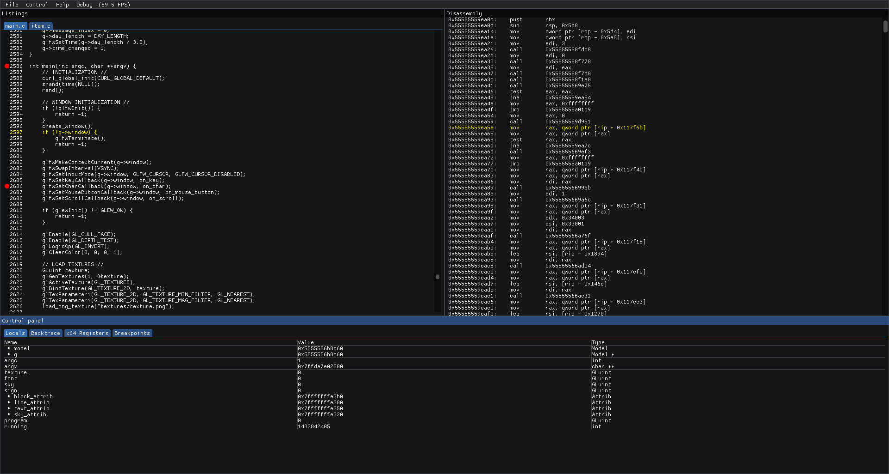

# debag

debag is a Linux debugger aimed at x86_64 programs, created with DWARF debugging symbols. The aim is to allow the user to inspect values of variables and see the execution flow primiarly. No plans are made to support things like remote debugging or expression evaluation. This is supposed to be the answer for GDB, that answers quickly the question of “where am I in the code?”, “what value does this variable have?”.

User interface is created using OpenGL and ImGui. It’s modeled after Visual Stuio’s debugger with simmilar keybindings and window layout. General support is focused on the C langugage but C++ support may come. The debugger engine is written from scratch without the use of GDB. Dependencies are kept to the minimum and all the libraries necessary and staticly linked with the executable. It runs on many distributions without the requirenment for installing additional packages. The current state of the debugger is very-early alpha, that lacks some features like multi-thread support.
